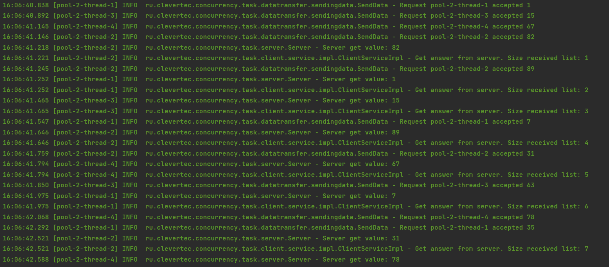
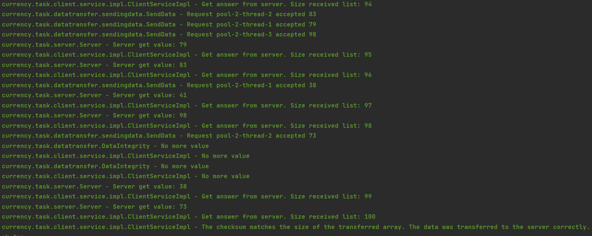

**Проект:** Проект с поддержкой работы в многопоточной среде. 
Имеется **Клиент** и **Сервер**, у _Клиента_ есть список значений от 1 до n, 
который он передает по одному значению случайным образом на _Сервер_, 
а _Сервер_ их принимает и в ответ на принятие каждого значения отправляет 
ответ _Клиенту_ с размером списка полученных элементов на момент ответа.
После отправки всех значений происходит проверка корректности и 
целостности переданных значений, через контрольную сумму всех элементов 
полученных _Сервером_ и размером этого списка.
Если проверка целостности переданных значений не проходит - выкидывается 
соответствующее исключение (выводится в логи).

Ниже представлены несколько скриншотов отображения в логах работы данного приложения, при длине 
передаваемого списка 100 и 4 работающих потоках.

